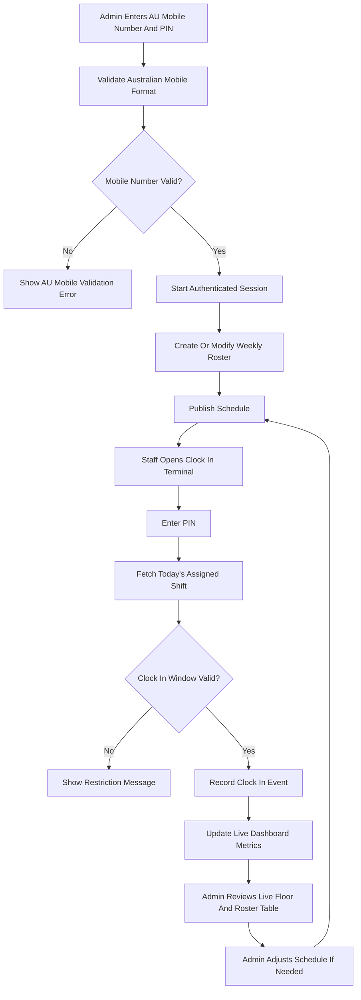

## 1. Product Overview
Restaurant Workforce Management is a restaurant-focused SaaS web application designed to clock staff in and out daily based on the published roster, with an admin workflow to create, modify, and manage staff schedules.
- It solves roster-to-attendance gaps by ensuring staff clock-in events are validated against scheduled shifts, while giving managers real-time operational visibility.
- It delivers a single operational surface for schedule planning, clock-in compliance, and staff management, with an architecture that can expand into leave, reporting, and payroll readiness later.

## 2. Core Features

### 2.1 User Roles
| Role | Registration Method | Core Permissions |
|------|---------------------|------------------|
| Super Admin | Provisioned by platform owner | Manage tenants, restaurants, branches, global settings, access control, compliance, reports, and audit logs |
| Restaurant Admin | Invited by Super Admin | Manage restaurant configuration, branches, departments, employees, rosters, announcements, approvals, and restaurant-level reports |
| Manager | Invited by Restaurant Admin | Approve leave, manage shifts, oversee attendance, publish schedules, and supervise daily operations |
| Supervisor | Invited by Restaurant Admin or Manager | Monitor attendance, handle task progress, review shift adherence, and manage floor-level operations |
| Employee | Invited by authorized admin | Access schedule, clock in/out, request leave, view notifications, announcements, and personal attendance summaries |

### 2.2 Feature Modules
1. **Authentication And Roles**: admin mobile login using Australian mobile numbers only, PIN-based sign-in, session persistence, protected routes, middleware authentication, and role-based access.
2. **Admin Dashboard (Screen 1)**: daily overview, staff clocked-in status, active shifts, live floor summary, today roster table, and alerts.
3. **Staff Clock In Terminal (Screen 2)**: PIN entry, clock in and out confirmation, current shift status, hours worked, and upcoming shifts.
4. **Schedule Management (Screen 3)**: weekly roster grid, create/modify/delete shift assignments, drag and drop planning, and publish schedule.
5. **Staff Directory (Screen 4)**: staff cards, role and status chips, filters, add staff, and quick schedule or payroll context.
6. **Future Modules (Post-MVP)**: leave management, announcements, tasks, reports, notifications, audit logs, and payroll-ready exports.

### 2.3 Page Details
| Page Name | Module Name | Feature Description |
|-----------|-------------|---------------------|
| Auth Pages | Mobile-first sign in | Australian mobile number validation, PIN entry keypad, sign-in feedback, and session recovery flows |
| Admin Dashboard | Daily overview | Staff clocked in, active shifts, labor utilization, live floor status, roster table, and quick actions |
| Staff Clock In | PIN terminal | PIN input, clock-in confirmation, on-shift status, hours worked, and weekly roster preview |
| Staff Schedule | Weekly roster | Weekly view, role lanes, shift cards, modify schedule workflow, and assign staff to open shifts |
| Staff Directory | People management | Staff cards with status, filters, add staff, and context panels for compliance and hours |

## 3. Core Process
The primary flow starts with admin authentication through a mobile-first sign-in experience that accepts Australian mobile numbers only. After successful login, admins plan and publish the roster. Once a schedule is published, staff clock in through a terminal-style screen that validates the clock-in event against the assigned shift. Admins monitor clock-in compliance in real time and can adjust schedules when needed. Attendance and schedule changes trigger in-app updates and optional notifications.



## 4. User Interface Design
### 4.1 Design Style
- Primary colors: deep navy and slate surfaces with a vivid mint/emerald accent for primary actions and confirmation states.
- Secondary colors: cool cyan/teal highlights for active navigation, subtle amber/red for warnings and overtime risk, and low-contrast neutrals for dense tables.
- Button style: high-radius pill buttons, soft inner borders, and a single strong primary action per screen.
- Typography: clean geometric sans for headings and UI, paired with a mono font for time, IDs, and shift metadata.
- Layout style: left rail navigation, top search and utilities bar, rounded glassy panels, and dense operational cards.
- Icon style: Lucide icons with consistent stroke weight, status chips, and minimally animated micro-interactions.
- Motion style: subtle hover lift on cards, slide-in toast confirmations, and gentle stagger reveals for dashboard sections.

### 4.2 Page Design Overview
| Page Name | Module Name | UI Elements |
|-----------|-------------|-------------|
| Login | Mobile auth | Brand header, restaurant backdrop, Australian mobile input, PIN input, keypad, validation, and primary sign-in action |
| Admin Dashboard | Daily overview | Left sidebar, top search, KPI cards, live floor strip, roster table, swap panel, and primary clock action |
| Staff Clock In | PIN terminal | Large PIN keypad, status cards for on shift and earnings/hours, weekly roster preview, and success toast |
| Staff Schedule | Weekly roster | Week grid with shift chips, summary KPI row, view toggle, modify schedule action, and open shift assignment |
| Staff Directory | Staff management | Payroll summary cards, distribution card, staff cards with status chips, filter button, and add staff action |

### 4.3 Responsiveness
The platform uses a desktop-first layout optimized for admin workflows, dense operational data, and multi-panel interactions. Tablet layouts collapse secondary panels and preserve key actions, while mobile layouts prioritize employee self-service tasks such as shifts, clock actions, leave requests, and notification consumption. Touch targets, sticky action areas, and simplified filter drawers support smaller screens without compromising core workflows.

## 5. Enterprise Folder Structure
```text
app/
  (auth)/
  (dashboard)/
  api/
  globals.css
  layout.tsx
  not-found.tsx
  error.tsx
components/
  ui/
  layout/
  shared/
  charts/
features/
  auth/
  dashboard/
  restaurants/
  employees/
  roster/
  attendance/
  leave/
  notifications/
  announcements/
  tasks/
  reports/
  settings/
  audit-logs/
hooks/
services/
repositories/
types/
lib/
utils/
middleware/
supabase/
  client/
  server/
  policies/
public/
styles/
database/
  migrations/
  seeds/
  views/
edge-functions/
docs/
tests/
  unit/
  components/
  integration/
  e2e/
```

## 6. Delivery Sequence
Development proceeds one module at a time in this order to keep the codebase compile-safe and production-ready:
1. Folder Structure
2. UI Theme
3. Authentication
4. Database Schema
5. Supabase Setup
6. Restaurant Module
7. Employee Module
8. Roster Module
9. Attendance Module
10. Clock In / Clock Out
11. Leave Management
12. Notifications
13. Reports
14. Settings
15. Admin Dashboard
16. Testing
17. Documentation
18. Deployment

Each phase must compile without errors, follow TypeScript strict mode, reuse shared components, avoid duplication, preserve clean naming, and keep commits modular for production deployment.
