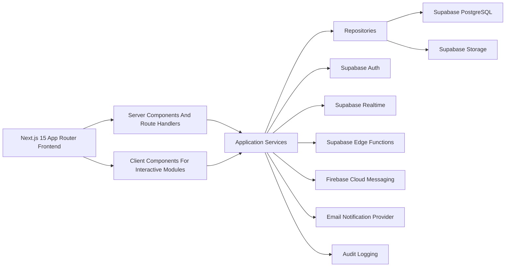
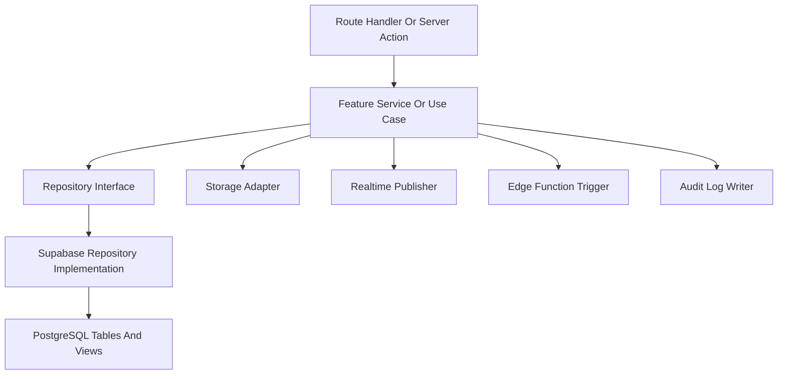
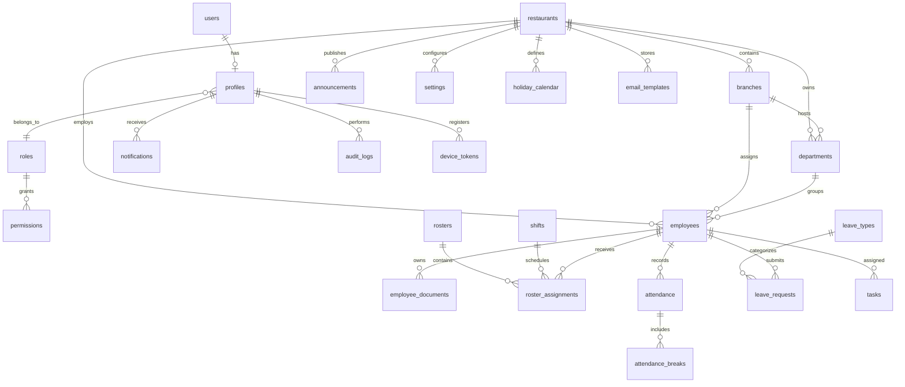

## 1. Architecture Design


## 2. Technology Description
- Frontend: Next.js 15 with App Router, React 19, TypeScript strict mode, Tailwind CSS v4, shadcn/ui, Lucide Icons, Framer Motion, TanStack Query, Zustand, React Hook Form, Zod, FullCalendar, Recharts, and React Table.
- Backend: Supabase for Authentication, PostgreSQL, Storage, Realtime, Edge Functions, Row Level Security, and generated TypeScript database types.
- Deployment: Vercel for the frontend application and Supabase for database, auth, storage, realtime, and edge functions.
- Architecture Style: Clean Architecture with feature-based modules, repository pattern, SOLID principles, reusable shared components, and strict client/server component boundaries.
- Notification Stack: Browser push through Firebase Cloud Messaging, in-app notification center backed by Supabase Realtime, and email notifications triggered through edge functions.
- Security Stack: JWT-based auth through Supabase, middleware guards, route protection, server-side validation, CSRF protection for sensitive actions, rate limiting, security headers, and audit logging.

## 3. Route Definitions
| Route | Purpose |
|-------|---------|
| / | Role-aware landing page that routes authenticated users to the correct home screen |
| /login | Admin authentication using Australian mobile number and PIN |
| /forgot-password | Password recovery request |
| /reset-password | Password reset completion |
| /verify-email | Email verification guidance and resend action |
| /admin/dashboard | Screen 1: admin dashboard daily overview |
| /admin/schedule | Screen 3: weekly roster planning and modify schedule |
| /admin/staff | Screen 4: staff directory management |
| /clock-in | Screen 2: staff PIN clock-in terminal |
| /schedule | Staff schedule view (read-only) |
| /staff | Staff directory view (read-only) |

## 4. Folder Structure Strategy
```text
app/
  (auth)/
  (dashboard)/
components/
  ui/
  layout/
  shared/
  charts/
features/
  auth/
    components/
    hooks/
    schemas/
    services/
    repositories/
    types/
  dashboard/
  roster/
  attendance/
  employees/
hooks/
services/
repositories/
lib/
utils/
types/
middleware/
supabase/
  client/
  server/
  policies/
  storage/
  realtime/
styles/
database/
  migrations/
  seeds/
  functions/
edge-functions/
docs/
tests/
```

## 5. Frontend Layering
- App Layer: Next.js route segments, layouts, middleware, route handlers, and server actions where appropriate.
- Presentation Layer: feature-scoped screens and reusable components using shadcn/ui and Tailwind CSS tokens.
- Application Layer: use cases and orchestration services for auth, dashboards, roster publication, attendance validation, notifications, and reporting.
- Domain Layer: entities, value objects, permission rules, and Zod schemas for each module.
- Infrastructure Layer: Supabase clients, repositories, storage adapters, FCM integration, email providers, realtime subscriptions, and export utilities.

## 6. API Definitions
### 6.1 Core TypeScript Contracts
```ts
export type AppRole =
  | "super_admin"
  | "restaurant_admin"
  | "manager"
  | "supervisor"
  | "employee";

export interface AuthSessionUser {
  id: string;
  email: string;
  role: AppRole;
  restaurantId?: string | null;
  branchId?: string | null;
}

export interface ApiResponse<T> {
  data: T;
  message?: string;
  meta?: {
    page?: number;
    pageSize?: number;
    total?: number;
  };
}

export interface PaginatedQuery {
  page?: number;
  pageSize?: number;
  search?: string;
  sortBy?: string;
  sortOrder?: "asc" | "desc";
}
```

### 6.2 Representative Route Handlers
| Method | Endpoint | Purpose |
|--------|----------|---------|
| POST | /api/auth/login | Handle admin sign-in using Australian mobile number and PIN |
| POST | /api/auth/validate-mobile | Validate and normalize Australian mobile numbers |
| POST | /api/auth/forgot-password | Request password reset email |
| POST | /api/auth/reset-password | Complete password reset |
| POST | /api/clock-in/pin | Validate staff PIN and return staff context |
| GET | /api/dashboard/summary | Return admin daily overview KPIs |
| GET | /api/roster/week | Return the weekly roster grid |
| POST | /api/roster/assignments | Create shift assignments |
| PATCH | /api/roster/assignments/:id | Modify shift assignments |
| DELETE | /api/roster/assignments/:id | Delete shift assignments |
| POST | /api/roster/publish | Publish roster and trigger realtime updates |
| POST | /api/attendance/clock-in | Validate roster window and record clock-in |
| POST | /api/attendance/clock-out | Record clock-out and compute working hours |
| GET | /api/staff | Paginated staff directory listing with filters |
| POST | /api/staff | Create staff profile and schedule eligibility |

### 6.3 Validation Approach
- Use Zod schemas at input boundaries for route handlers, server actions, and form payloads.
- Convert Supabase row data to typed domain models before exposing to UI components.
- Enforce authorization in middleware, route handlers, repositories, and RLS policies for defense in depth.

## 7. Server Architecture Diagram


## 8. Data Model
### 8.1 Data Model Definition


### 8.2 Table Intent
| Table | Purpose |
|-------|---------|
| users | Supabase auth identities and platform auth metadata |
| profiles | Application profile linked to auth identity and role |
| restaurants | Tenant-level restaurant entities |
| branches | Operational restaurant branches |
| departments | Organizational units such as kitchen, service, or admin |
| roles | Application role catalog |
| permissions | Fine-grained permission catalog by role |
| employees | Employment records and operational metadata |
| employee_documents | Securely stored document references and metadata |
| shifts | Shift templates and timing rules |
| rosters | Weekly or monthly published schedule containers |
| roster_assignments | Employee shift allocations |
| attendance | Clock events and derived attendance summaries |
| attendance_breaks | Break tracking associated with attendance sessions |
| leave_types | Leave category configuration |
| leave_requests | Employee leave workflow records |
| notifications | In-app notification feed items |
| announcements | Restaurant notices with scheduling and pinning |
| tasks | Operational tasks and progress tracking |
| settings | Business and attendance configuration |
| holiday_calendar | Public and business holiday definitions |
| audit_logs | Immutable records of sensitive actions |
| device_tokens | Browser push token registration |
| email_templates | Managed notification template content |

## 9. Data Definition Language
### 9.1 Modeling Rules
- Primary keys use `uuid` with `gen_random_uuid()`.
- All business tables include `created_at`, `updated_at`, and optional `deleted_at` where soft deletion is required.
- Multi-tenant tables store `restaurant_id` when restaurant scoping is required.
- High-volume filter columns receive indexes for search, approvals, date ranges, and dashboard aggregations.
- Sensitive fields such as salary, bank details, TFN, and document references remain access-controlled through RLS and role-checked services.

### 9.2 Representative DDL
```sql
create table public.roles (
  id uuid primary key default gen_random_uuid(),
  code text not null unique,
  name text not null,
  created_at timestamptz not null default now()
);

create table public.restaurants (
  id uuid primary key default gen_random_uuid(),
  name text not null,
  slug text not null unique,
  logo_path text,
  contact_email text,
  contact_phone text,
  timezone text not null default 'Australia/Sydney',
  latitude numeric(9,6),
  longitude numeric(9,6),
  radius_meters integer not null default 100,
  opening_hours jsonb not null default '{}'::jsonb,
  created_at timestamptz not null default now(),
  updated_at timestamptz not null default now()
);

create table public.employees (
  id uuid primary key default gen_random_uuid(),
  profile_id uuid not null references public.profiles(id) on delete cascade,
  restaurant_id uuid not null references public.restaurants(id) on delete cascade,
  branch_id uuid references public.branches(id) on delete set null,
  department_id uuid references public.departments(id) on delete set null,
  employee_code text not null unique,
  first_name text not null,
  last_name text not null,
  email text not null,
  phone text,
  employment_type text not null,
  joining_date date not null,
  status text not null default 'active',
  salary numeric(12,2),
  tfn text,
  bank_details jsonb,
  visa_expiry date,
  emergency_contact jsonb,
  created_at timestamptz not null default now(),
  updated_at timestamptz not null default now()
);

create index employees_restaurant_branch_idx
  on public.employees (restaurant_id, branch_id, status);
```

### 9.3 Views
- `attendance_daily_summary_view` for daily attendance KPIs by restaurant, branch, and department.
- `late_arrival_report_view` for trend analysis of late clock-ins and approval status.
- `payroll_ready_summary_view` for regular hours, break hours, overtime, weekends, and public holiday aggregation.
- `notification_unread_count_view` for fast badge rendering.

### 9.4 Triggers And Functions
- `set_updated_at()` trigger for update timestamps.
- `handle_new_user_profile()` function to create default profile after auth signup or invitation acceptance.
- `calculate_attendance_metrics()` function to derive late minutes, early leave, overtime, and anomaly markers.
- `recalculate_leave_balance()` function when leave requests change approval status.
- `write_audit_log()` function for critical mutations routed through secure procedures.
- `notify_roster_publication()` edge-invoked workflow for in-app, push, and email notifications.

### 9.5 Seed Data
- Default roles: Super Admin, Restaurant Admin, Manager, Supervisor, Employee.
- Permission matrix entries aligned to module access.
- Leave types: Annual, Sick, Emergency, Compassionate, Unpaid.
- Demo restaurant, branch, department, and shift templates for non-production bootstrapping.
- Baseline settings for timezone, attendance windows, GPS radius, and notification preferences.

## 10. Supabase Setup
### 10.1 Authentication
- Configure email/password auth, email verification, secure password reset redirects, and invitation flows.
- Store app-specific role and restaurant context in `profiles`.
- Use middleware to hydrate session state and redirect unauthenticated users.

### 10.2 Storage Buckets
- `restaurant-logos` for restaurant and branch branding assets.
- `employee-documents` for passports, visas, driver licences, certificates, and contracts.
- `announcement-assets` for images and PDFs attached to notices.
- Restrict object access by role, restaurant scope, and ownership where applicable.

### 10.3 Realtime Subscriptions
- Notifications feed updates by `profile_id`.
- Announcement publication updates by `restaurant_id`.
- Attendance anomaly and approval events for manager dashboards.
- Leave approval status changes for requesting employees.

### 10.4 Edge Functions
- `send-notification-event`
- `send-email-template`
- `publish-roster`
- `process-attendance-anomaly`
- `register-device-token`
- `generate-report-export`

### 10.5 Row Level Security Policies
- Super Admin can access all tenant data.
- Restaurant Admin can access records scoped to assigned restaurant.
- Manager and Supervisor can access operational records scoped to permitted branches or departments.
- Employees can access only their own profile, attendance, leave, notifications, and assigned shifts.
- Sensitive financial and compliance fields require stricter role checks beyond generic restaurant scope.

## 11. Security Design
- Enforce RLS on every table before exposing any data to the application.
- Wrap high-risk writes in secure route handlers or edge functions with explicit role verification.
- Validate every incoming payload with Zod on the server.
- Apply rate limiting to auth, exports, attendance submission, and notification endpoints.
- Add CSRF defenses for state-changing browser requests where applicable.
- Store secrets in environment variables only and never in client bundles.
- Write audit entries for approvals, settings changes, employee edits, roster publication, attendance overrides, and security-sensitive actions.

## 12. Testing Strategy
- Unit tests for domain services, validation schemas, helper functions, and repository mapping logic.
- Component tests for forms, tables, cards, dialogs, and notification center behavior.
- Integration tests for auth flows, dashboard data loading, roster publication, attendance rules, and leave approvals.
- End-to-end placeholders for login, employee clock in/out, manager approval flow, and report export flows.

## 13. Delivery Plan
The implementation sequence follows the approved PRD and is intentionally incremental:
1. Establish folder structure, design tokens, and shared foundations.
2. Implement authentication and protected routing.
3. Deliver database schema, migrations, RLS, storage, and Supabase type generation.
4. Build feature modules one at a time in compile-safe order.
5. Add reporting, settings, audit logging, and notification channels.
6. Complete testing, documentation, and deployment readiness for Vercel and Supabase.
